# recipe-hub
The recipe hub is a recipe sharing website. Visitors can peruse recipes and if they'd like to join the community they can register and begin sharing recipes immediately. As a member they can also comment on recipes. The site offers an easy recipe form to fill in and after approval by the Site Admin, the recipes are displayed. The recipes are sorted by those submitted most recently in a visually pleasing manner with an image, a short description, an easy-to-read list of ingredients and instructions.   

The live version of the recipe hub project is [here](https://bmich22-recipe-hub-992a8a88adad.herokuapp.com/).

### Screenshots of Home Page
| Large and Medium Screen | Small Screen 
| ----------- | ----------- 
| 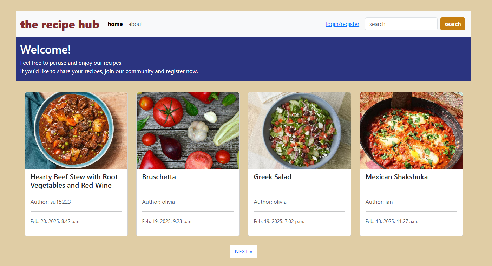|  

### UX / Wireframes / User Stories / Database Models / Colors
The initial building blocks of the project were the wireframes and user stories. The wireframes served as a visual blueprint for the layout and structure of the site and the user stories provided insight into what functions were needed. Planning the databases helped visualize how the data is linked and how the databases could be queried to pull the desired information.  

WIREFRAMES

| Home | Login | Member | CRUD | Recipe Detail
| ---- | ----- | ----- | ---- | ------------- 
| 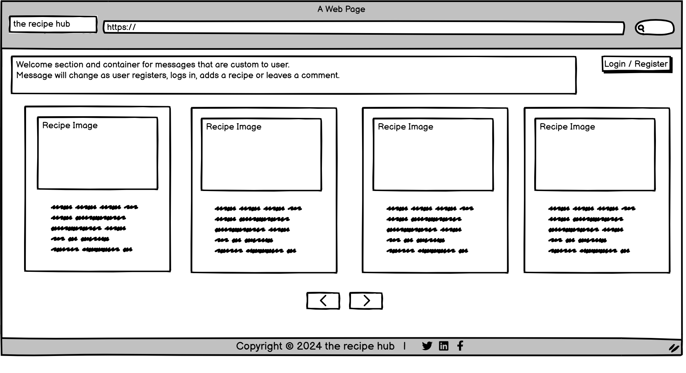 | 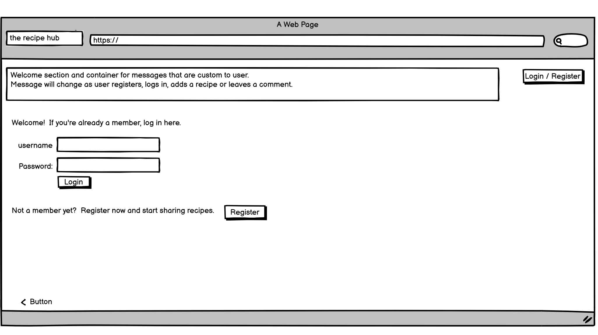 | 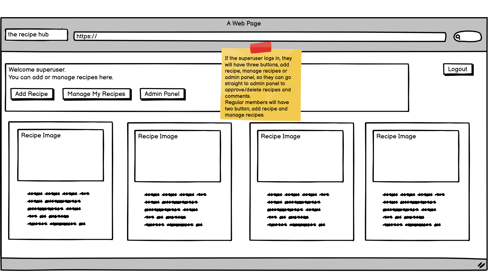 | 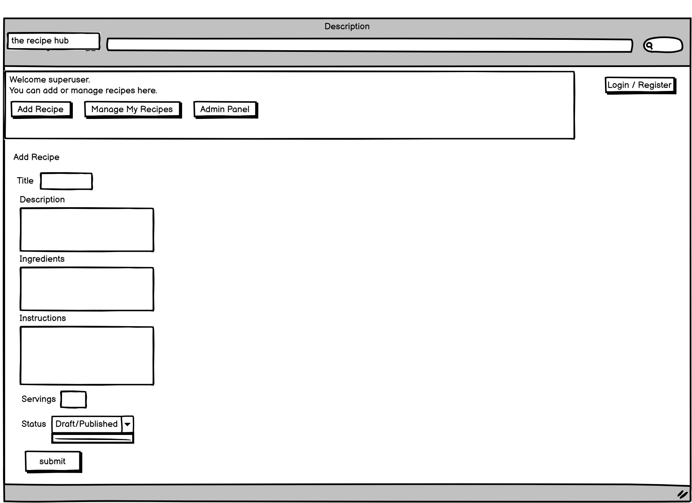 | 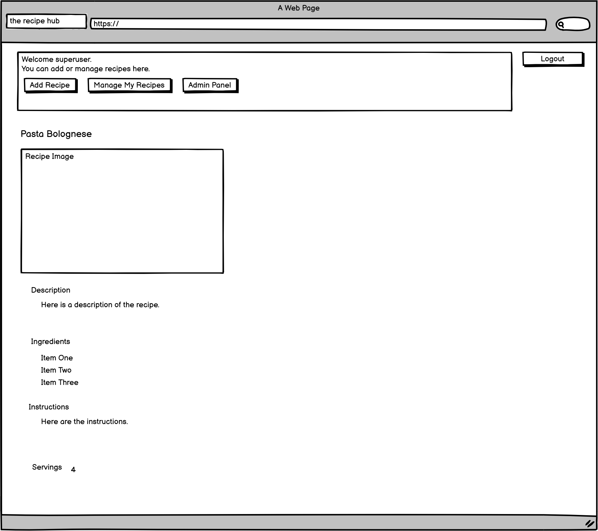

USER STORIES

| As a... | I can... | So that.. | Features
|----------|----------|--------- | --------
| Site User  | view list of recipes   | I can select which recipe I want to view | Create recipe database, create recipe list view
| Site User  | view a recipe | I can see the recipe details and any comments | Create a function so user can go from  list to specific recipe, create recipe detail view
| Site User  | search for recipes by ingredient   | I can find what recipes that interest me | Create search bar, implement search functionality, use recipe list view with search criteria
| Site User  | register an account   | I can submit recipes and comment on my own and other recipes | Create registration form and link from home page
| Site User  | create and submit recipes  | I can share recipes with the community | Create form for adding recipe, implement upload and save function
 Site User  | modify or delete my recipe   | I can correct mistakes or come back to it later | Add edit and delete recipe function
 | Site User  | see the About section   | I can read about the site and who is running it | Create about section
 | Site Admin  | approve and/or disapprove recipes  | I can keep content on the site current | Create admin panel and give access to site admin
 | Site Admin  |  approve and/or disapprove comments  | I can keep content on the site current and filter out objectional comments | Create comments section in admin panel with approve/disapprove/delete comment function
 | Site Admin  | create or update the about page content  | information about the site owner is available to the users | Create add, edit, delete function on about page
 

 DATABASE MODELS

 | Home | Login 
 | ---- | ----- 
 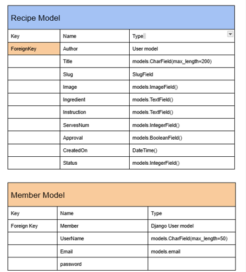 | 

 COLORS

  

### Features
| Feature | Screenshot 
| ------- | ----------
| The site is responsive and displays nicely on all screen sizes.  Bootstrap was used to format the content, utilizing its columns and grids, its container-fluid and image-fluid, as well as utility styling on text, padding and margins. |  
| Home page displays a visually pleasing view of four recipes at a time with ‘next’ and ‘back’ arrows to navigate through the list. | 
| Search field enables visitors to search recipes by ingredient. | 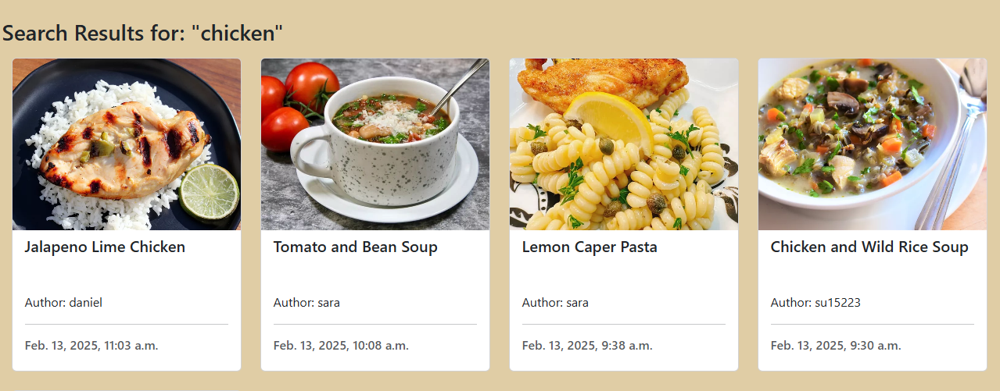
| Visitors can become members by filling an easy registration sign up form, supplying username, email address and password.| 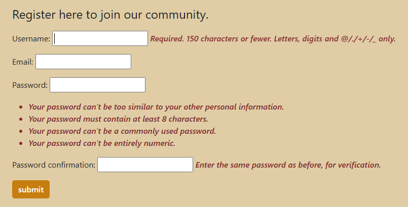
| Once logged in, members can add recipes to the site by clicking the “create a recipe” button and filling in a form. Members can save a draft of their recipe and come back to finish it later or click “publish” and the recipe will be ready for approval by the admin. | 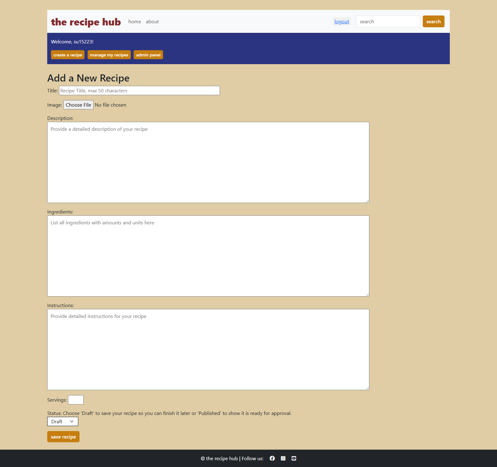
| Members can click on the 'manage recipes' button and a list of their recipes will appear.  On this screen they can easily see if a recipe has not yet been approved by a red message that appears at the bottom of the recipe card. | 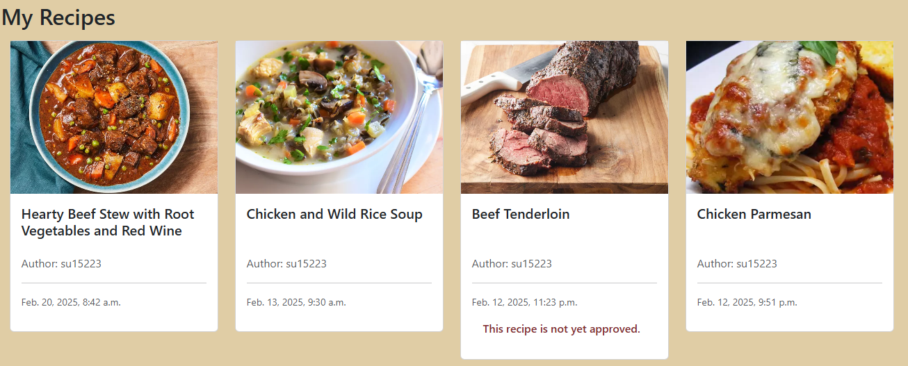
| Members can make comments on any recipe and they can edit and delete those comments later. JavaScript was used for the edit comment functionality. |   
| The superuser has access to the admin panel directly from the member screen.  Their welcome message will display three buttons – create recipe, manage recipes and admin panel, rather than the normal two – create recipe, manage recipes, for regular members. | 
| The superuser can add recipes either through the form on the website or via the admin panel. | 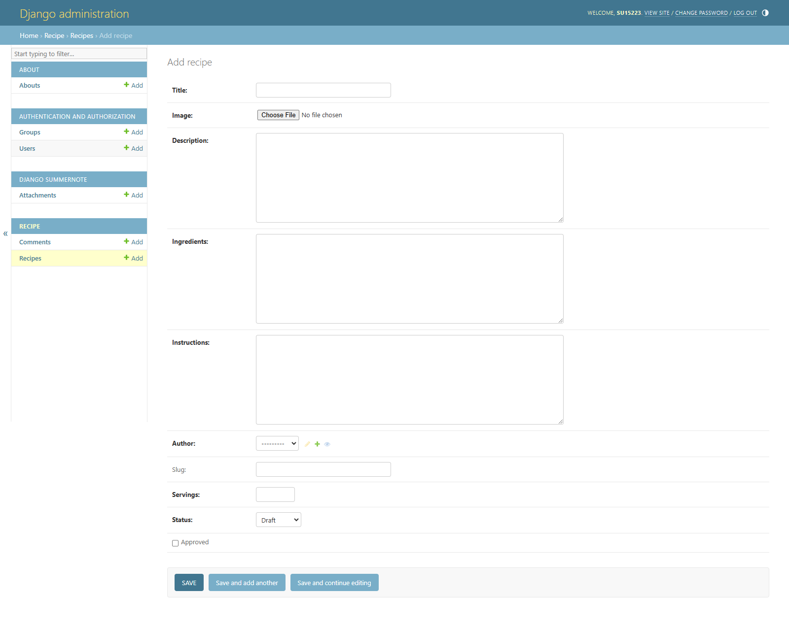
| The superuser can approve recipes through the admin panel, one at a time so that the superuser can be certain that all elements are in place and formatting and syntax is good. | 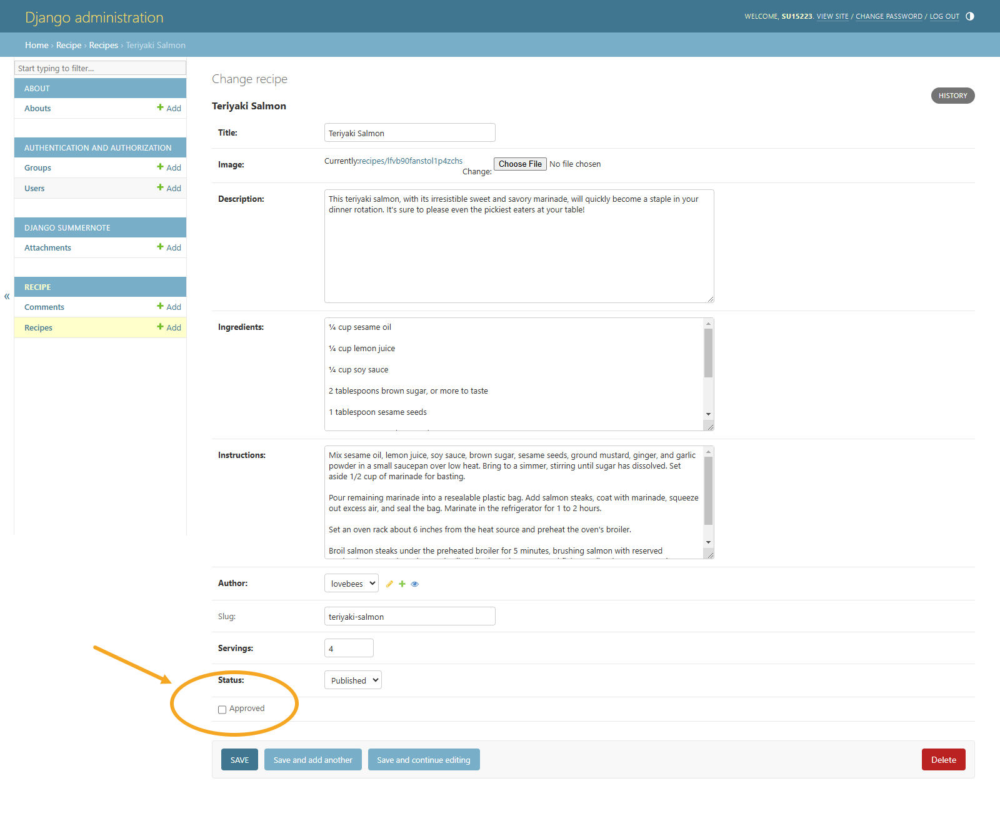
| Comments can be approved and deleted in bulk, directly from the Comments Panel.  This makes approving comments very quick and easy. | 
| The About section displays information about the site and the site owner. The information is in a database so that in the future there could be a group of contributors showcased on these pages. | 
| The superuser manages the About content through the Admin panel.  The text editor has rich text formatting capability. | 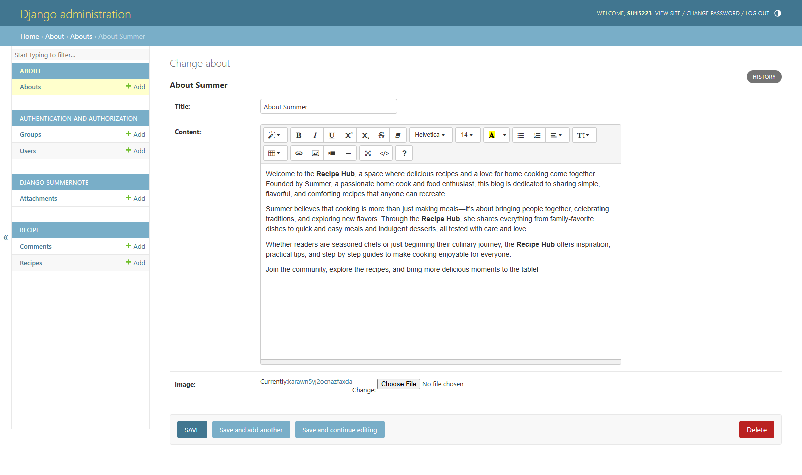 

### Future Features
***Recipe Box/Favorites***
Members will be able to choose favorites and save them in a “recipe box” so they can access the recipes easily at a later time.

***Message to the Site Administrator***
Visitors and/or members will be able to send the Site Administrator a message through the site.

***Ratings***
Members will be able to rate recipes and these ratings would be shared on the recipe details page.

***Add Nutrition Information***

### Tools and Technologies Used
| Tool | Technology
| ---- | ----------
| [GitHub](http://github.com//) | Version control platform used for storing and managing this project.
| [VS Code](https://code.visualstudio.com///) | Local code editor with Git integration.
| [Django==4.2.18](https://www.djangoproject.com/) | Python web app framework.|
| HTML 5| The standard markup language for creating web pages and structuring content.
| CSS| A styling language used to design and layout web pages, enhancing their appearance and responsiveness.
| [Bootstrap 5.3.3](https://getbootstrap.com/docs/5.3/getting-started/introduction/) | A front-end framework that simplifies web development with pre-styled components and a responsive grid system. Used to format the content, utilizing its columns and grids, its container-fluid and image-fluid, as well as utility styling on text, padding and margins.
| [Font Awesome ](https://fontawesome.com/) | A library of scalable icons and symbols, used for the social icons on the footer of the-recipe-hub.
| [Google Fonts](https://fonts.google.com/) | A collection of free, web-optimized fonts.
| JavaScript | Scripting language for web pages, used here for the edit comments functionality.
| [Python](https://www.python.org/)| Programming language to create web applications, used here inside the django framework.
| [PostgreSQL](https://www.postgresql.org/) | An open-source relational database system used for storing and managing data. Used for managing the recipe, member and comment databases and the built-in User database.
| [Google Chrome Dev Tools](https://developer.chrome.com/docs/devtools) | Web development tools built into Chrome for debugging and optimizing web applications
| [Cloudinary](https://cloudinary.com/) | A cloud-based image and video management service used for storing, processing, and delivering media efficiently, used for storing and accessing the recipe and about images.
| [Heroku](http://heroku.com) | A cloud platform that simplifies the deployment and hosting of web applications, used to deploy the-recipe-hub.
| [Balsamiq](https://balsamiq.com/) | A wireframing tool utilized in the planning phase of the-recipe-hub.
| [Flake8](https://flake8.pycqa.org/en/latest/) | A Python linting tool that checks for style guide enforcement and potential errors in code. Used inside VS Code.
| [Black 2024.6.0](https://black.readthedocs.io/en/stable/) | A Python code formatter that ensures consistent code style by automatically formatting code according to best practices. Used inside VS Code.
|[Gunicorn==20.1.0](https://gunicorn.org/) | A Python WSGI HTTP server used to serve web applications built with Django and acts as intermediary with Heroku.
| ChatGPT | 

### Testing
Continuous manual testing was performed as features were added to the project to ensure forms were loading and data was processed to and from the database. Responsiveness was tested inside Google Chrome Dev Tools to ensure the site is visually pleasing on all screen sizes. In addition, the HTML, CSS, and Python were run through linters to ensure clean, consistent, error-free code. The outcomes are below.  

| Tool | Outcome
| ---- | ----------
|[Code Institute Python Linter](https://pep8ci.herokuapp.com/) | All .py files were run through the CI Python Linter. recipe/models.py, recipe/views.py, my_project/settings threw 'line-too-long' errors (anything over 79 characters) but after consultation with [Django documentation](https://docs.djangoproject.com/en/dev/internals/contributing/writing-code/coding-style/#python-style), *"An exception to PEP 8 is our rules on line lengths. Don’t limit lines of code to 79 characters if it means the code looks significantly uglier or is harder to read. We allow up to 88 characters as this is the line length used by black. This check is included when you run flake8. Documentation, comments, and docstrings should be wrapped at 79 characters, even though PEP 8 suggests 72.*
| [W3C HTML Validator](https://validator.w3.org/) | All .html documents were run through the validator.  Errors were thrown due to the validator not liking the Django template language and not recognizing the 'extends base.html' template.  Otherwise, no errors.
[W3C HTML Validator](https://jigsaw.w3.org/css-validator/) | No errors on style.css.
| recipe/test_forms.py | Automated test on recipe model and form, no errors
| member/test_forms.py | Automated test on registration form, no errors
| Manual test to check that member_recipes view and member_recipes.html is rendering properly | 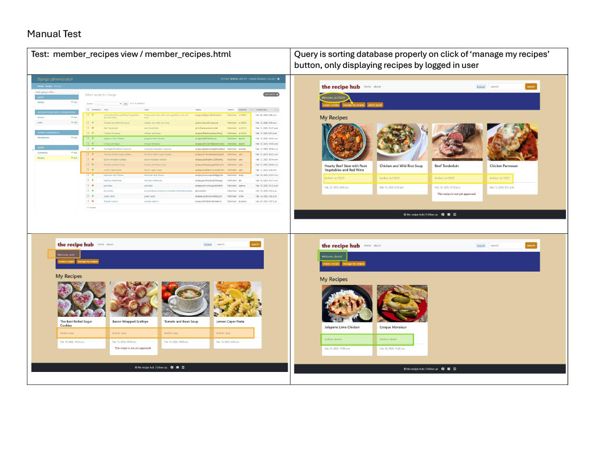 

### Unfixed Bugs
No unfixed bugs.

### Deployment

Heroku was used to deploy the site.
1. Sign up for Heroku account.
2. Create a new App and name it a unique name.
3. Complete Settings section, add Config Vars:
    * database - PostgreSQL
    * image handling - Cloudinary
    * disable collectstatic
4. Go to Deploy section, select Github and confirm, choose the recipe-hub repository, click connect to link Heroku to the Github repository code.
5. Click deploy, manual deploy
6. Wait for the message, "Your app was successfully deployed" then click VIEW.

The live link is [here](https://bmich22-recipe-hub-992a8a88adad.herokuapp.com/).

### Additional Credit
| Source |  Notes |
| ------ |  ----- |
| [ChatGPT](https://chatgpt.com/) | Extremely useful for both large-scale logical questions and the small-scale, fine-tuning of code.
| [All Recipes](http://allrecipes.com) | All of the content, images, ingredients, instructions and servings came direct from recipes in the All Recipes website. Recipe titles were sometimes altered.
| [Bellano Web Studio](https://bellanowebstudio.com/food-inspired-color-palettes/) | Provided ideas on color palettes for the-recipe-hub.
| [Pexels, Adonyi Gábor](https://www.pexels.com/photo/variety-of-vegetables-1400172/) | Placeholder food photo with vegetables.
| [Bootstrap Getting Started](https://getbootstrap.com/docs/5.3/getting-started/introduction/) | All about bootstrap classes for styling a responsive web app.

### Acknowledgements
Thank you to [Spencer Barriball](https://github.com/5pence?tab=repositories), my mentor at Code Institute.

